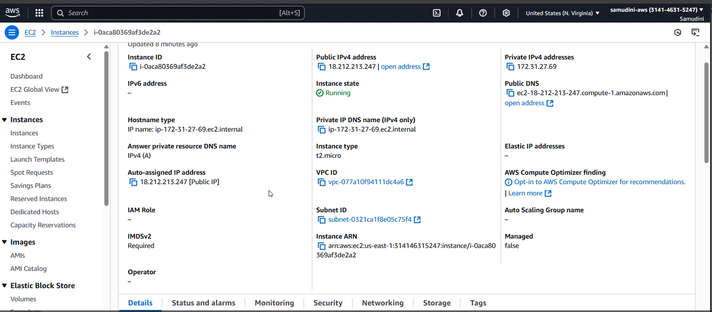
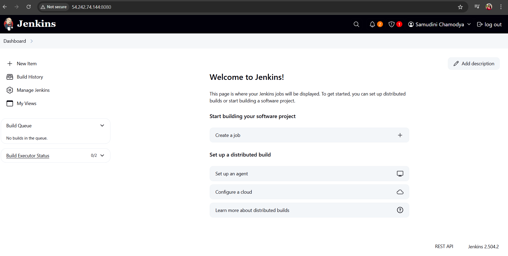
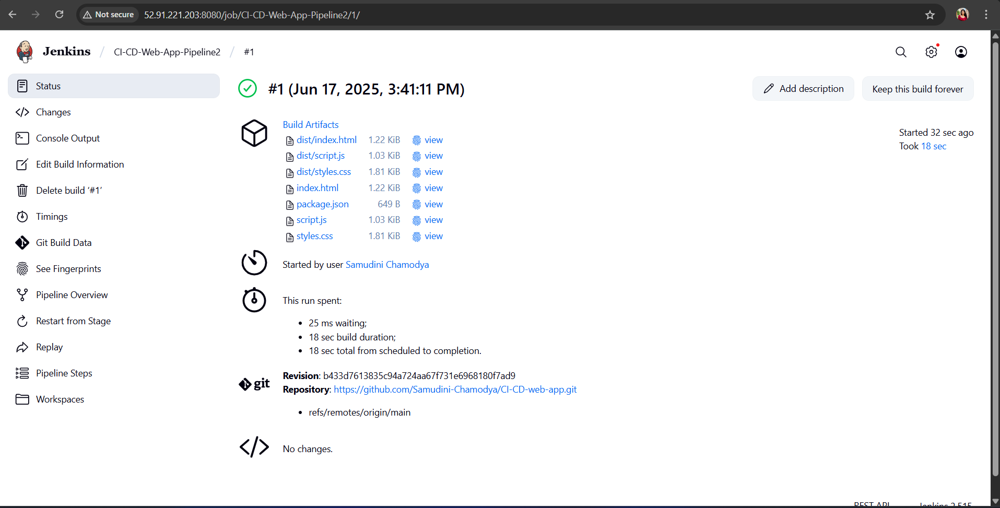
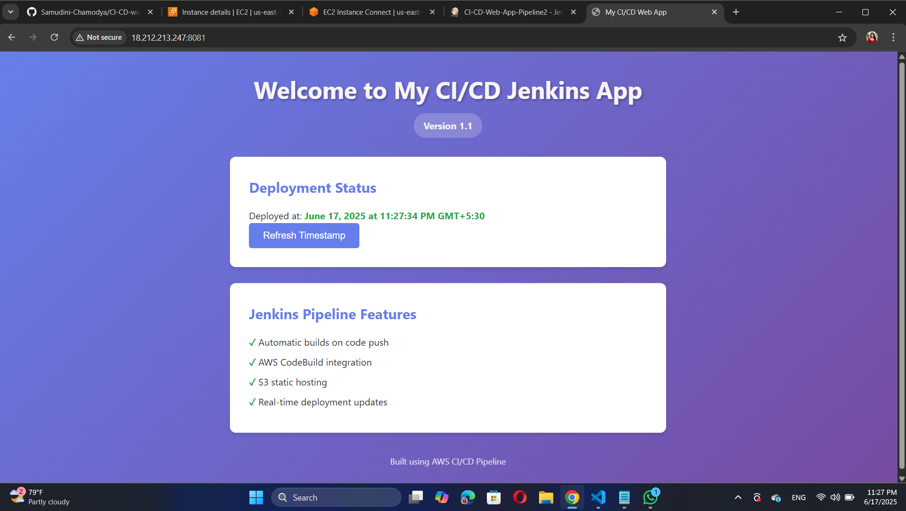
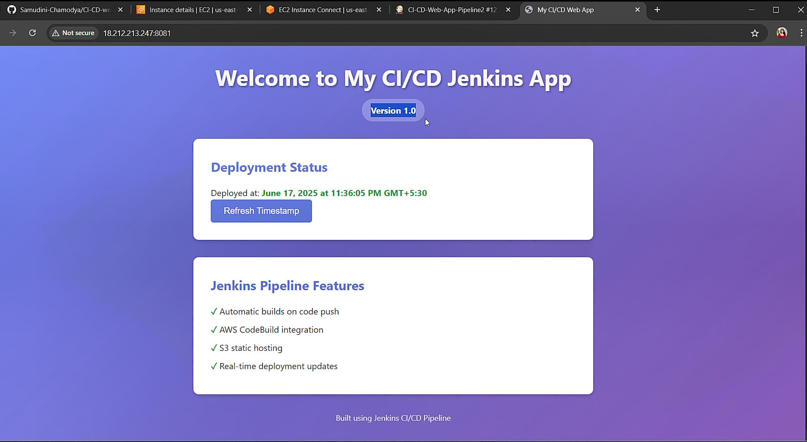

# CI/CD Web App with Jenkins

This repository contains a simple Node.js web application designed to demonstrate a Continuous Integration/Continuous Deployment (CI/CD) pipeline using Jenkins. The project focuses on automating the build, test, and deployment process with Jenkins on an AWS EC2 instance.

## Table of Contents
- [Overview](#overview)
- [Prerequisites](#prerequisites)
- [Setup Instructions](#setup-instructions)
  - [Fork the Repository](#fork-the-repository)
  - [Launch EC2 Instance](#launch-ec2-instance)
  - [Install Jenkins](#install-jenkins)
- [Jenkins Configuration](#jenkins-configuration)
  - [Create a Pipeline Job](#create-a-pipeline-job)
- [Pipeline Job Script](#pipeline-job-script)
- [Verifying the CI/CD Flow](#verifying-the-cicd-flow)
- [Screenshots](#screenshots)
- [Troubleshooting](#troubleshooting)

## Overview
The CI/CD-web-app is a basic Node.js application that serves a web page. This project uses Jenkins to automate the following:
- Pulling code from this GitHub repository.
- Installing dependencies with `npm install`.
- Running tests with `npm test`.
- Deploying the application to a server.

The main focus is on setting up a Jenkins Pipeline to manage the CI/CD process efficiently.

## Prerequisites
- An AWS account to launch an EC2 instance.
- Git installed on your local machine or EC2 instance.
- Basic knowledge of Node.js, Git, and Jenkins.
- SSH access to the EC2 instance.
- Internet connectivity for package installation and repository access.

## Setup Instructions

### GitHub Repository
 Visit [https://github.com/Samudini-Chamodya/CI-CD-web-app-jenkins](https://github.com/Samudini-Chamodya/CI-CD-web-app-jenkins).

4. Install dependencies locally to verify the setup:
   ```bash
   npm install
   npm test
  

### Launch EC2 Instance
1. Log in to the AWS Management Console and navigate to EC2.
2. Launch an EC2 instance:
   - Select **Ubuntu 20.04 LTS**.
   - Choose `t2.micro` (free tier eligible).
   - Create or use an existing key pair (e.g., `node-key.pem`).
   - Configure the security group to allow:
            - SSH (22): Your IP or 0.0.0.0/0
            - HTTP (80): 0.0.0.0/0
            - HTTPS (443): 0.0.0.0/0
            - Custom TCP (8080): 0.0.0.0/0  # For Jenkins
            - Custom TCP (8081): 0.0.0.0/0  # For app testing
     
3. Note the **Public IP** of the instance after launch.

### Install Jenkins
1. SSH into the EC2 instance:
   ```bash
   ssh -i my-key-pair.pem ec2-user@<EC2-Public-IP>
  
2. Update the system:
    ```bash
   sudo apt-get update -y  # For Ubuntu
  
3. Install Java (required for Jenkins):
     ```bash
   sudo apt-get install openjdk-11-jdk -y  # For Ubuntu
   
4. Install Jenkins:
    ```bash
   - For Ubuntu:
     curl -fsSL https://pkg.jenkins.io/debian/jenkins.io.key | sudo tee /usr/share/keyrings/jenkins-keyring.asc > /dev/null
     echo "deb [signed-by=/usr/share/keyrings/jenkins-keyring.asc] https://pkg.jenkins.io/debian binary/" | sudo tee /etc/apt/sources.list.d/jenkins.list > /dev/null
     sudo apt-get update
     sudo apt-get install jenkins -y
    
5. Start and enable Jenkins:
   ```bash
     sudo systemctl start jenkins
     sudo systemctl enable jenkins
   
6. Access Jenkins:
   - Open `http://<EC2-Public-IP>:8080` in your browser.
   - Retrieve the initial admin password:
     ```bash
     sudo cat /var/lib/jenkins/secrets/initialAdminPassword
     
   - Follow the setup wizard to install plugins and create an admin user.

## Jenkins Configuration

### Create a Pipeline Job
1. Log in to Jenkins at `http://<EC2-Public-IP>:8080`.
2. Click **New Item**.
3. Enter a name (e.g., `CI-CD-Web-App-Pipeline2`) and select **Pipeline**, then click **OK**.
4. Configure the job:
   - **General**: Add a description (e.g., "CI/CD pipeline for Node.js app").
   - **Pipeline**:
     - **Definition**: Select **Pipeline script from SCM**.
     - **SCM**: Choose **Git**.
     - **Repository URL**: Enter `https://github.com/Samudini-Chamodya/CI-CD-web-app-jenkins.git`.
     - **Script Path**: Enter `Jenkinsfile`.
   - **Build Triggers**: Enable **Poll SCM** with a schedule (e.g., `H/5 * * * *` for every 5 minutes).
5. Save the configuration.

## Pipeline Job Script
The `Jenkinsfile` defines the CI/CD pipeline. Place this file in the root of your repository.


      pipeline {
    agent any
    
    environment {
        NODE_VERSION = '18'
        APP_NAME = 'ci-cd-web-app'
        BUILD_PATH = 'dist'
    }
    
    tools {
        nodejs 'NodeJS-18'
    }
    
    stages {
        // Checkout Code
        stage('🔍 Checkout') {
            steps {
                echo "=== Starting Checkout Stage ==="
                git branch: 'main', 
                    url: 'https://github.com/Samudini-Chamodya/CI-CD-web-app.git'
                echo "✅ Code checked out successfully"
            }
        }

        // Display Environment Information
        stage('📋 Environment Info') {
            steps {
                echo "=== Environment Information ==="
                sh '''
                    echo "Node.js version:"
                    node --version
                    echo "NPM version:"
                    npm --version
                    echo "Current directory:"
                    pwd
                    echo "Directory contents:"
                    ls -la
                '''
            }
        }

        // Install Dependencies
        stage('📦 Install Dependencies') {
            steps {
                echo "=== Installing Dependencies ==="
                sh '''
                    if [ ! -f package.json ]; then
                        echo "Creating package.json..."
                        cat > package.json << 'EOF'
    {
      "name": "ci-cd-web-app",
      "version": "1.0.0",
      "description": "CI/CD Pipeline Demo Web Application",
      "scripts": {
        "start": "python3 -m http.server 8081 || node server.js",
        "test": "npm run test-basic",
        "test-basic": "node -e 'console.log(\"✅ Basic test passed\")'"
      }
    }
    EOF
                    fi
                    
                    npm install
                    echo "✅ Dependencies installed successfully"
                '''
            }
        }

        // Build Application
        stage('🔨 Build') {
            steps {
                echo "=== Building Application ==="
                sh '''
                    npm run build
                    echo "✅ Build completed successfully"
                '''
            }
        }

        // Run Tests
        stage('🧪 Test') {
            steps {
                echo "=== Running Tests ==="
                sh '''
                    npm test
                    echo "✅ All tests completed successfully"
                '''
            }
        }

        // Quality Check
        stage('📊 Quality Check') {
            steps {
                echo "=== Running Quality Checks ==="
                sh '''
                    echo "✅ Quality checks completed"
                '''
            }
        }

        // Deployment Simulation
        stage('🚀 Deploy Simulation') {
            steps {
                echo "=== Deployment Simulation ==="
                sh '''
                    echo "Simulating deployment to staging environment..."
                    sleep 2
                    PUBLIC_IP=$(curl -s http://169.254.169.254/latest/meta-data/public-ipv4 || echo "localhost")
                    echo "✅ Deployment simulation completed"
                    echo "Application would be available at: http://${PUBLIC_IP}:8081"
                '''
            }
        }

        // Start Application
        stage('🌐 Start Application') {
            steps {
                echo "=== Starting Application Server ==="
                sh '''
                    pkill -f "http.server.*8081" || true
                    pkill -f "node.*server" || true
                    
                    if [ -f "server.js" ]; then
                        nohup node server.js > app.log 2>&1 &
                        echo $! > app.pid
                    elif [ -f "index.html" ]; then
                        nohup python3 -m http.server 8081 > app.log 2>&1 &
                        echo $! > app.pid
                    fi
                    
                    sleep 5
                    PUBLIC_IP=$(curl -s http://169.254.169.254/latest/meta-data/public-ipv4 || echo "localhost")
                    echo "✅ Application started successfully!"
                    echo "🌐 Application URL: http://${PUBLIC_IP}:8081"
                '''
            }
        }
    }
    
    post {
        always {
            echo '=== Pipeline Completed ==='
            archiveArtifacts artifacts: 'dist/**,*.html,*.css,*.js,package.json,images/**', allowEmptyArchive: true, fingerprint: true
        }
        success {
            echo '🎉 ✅ Pipeline succeeded!'
        }
        failure {
            echo '💥 ❌ Pipeline failed!'
        }
    }


## Verifying the CI/CD Flow
1. Make a change to the repository (e.g., update `README.md`):
   
   echo "Updated for CI/CD test" >> README.md
   git add README.md
   git commit -m "Update README"
   git push origin main
  
2. Wait for the SCM poll interval (e.g., 5 minutes) or manually trigger the build in Jenkins.
3. Check the **Build History** in Jenkins to confirm the pipeline ran.
4. Verify the console output shows successful execution of `npm install`, `npm test`, and `npm start`.

## 📸 Screenshots


- **EC2 Instance Launch**  
   

- **Jenkins Installation**  
  

- **Pipeline Build**  
  

- **Successful Build**  
  

- **Successful Output After chages**  
  


## Troubleshooting
- **Jenkins not accessible**: Ensure port 8080 is open in the EC2 security group and Jenkins is running (`sudo systemctl status jenkins`).
- **npm install fails**: Verify Node.js and npm are installed (`node -v`, `npm -v`) and internet access is available.
- **SCM poll not triggering**: Check the poll schedule and GitHub repository URL in Jenkins.


